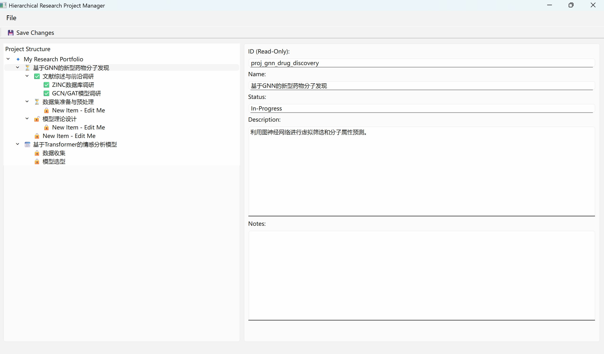

# Hierarchical Research Project Manager

A simple, desktop-based tool to manage your research projects and tasks in a hierarchical tree structure. Break down complex goals into manageable sub-tasks with this intuitive GUI application.


---

## Features

- **Nested Task Tree**: Organize tasks and sub-tasks to any depth.
- **Drag & Drop**: Easily re-arrange your task hierarchy.
- **Task Details**: Edit status, description, and notes for each task.
- **Right-Click to Add/Delete**: Intuitive context menu for managing your project structure.
- **Local YAML Storage**: Your data is saved in a human-readable `.yaml` file.

---

## How to Run

1.  **Prerequisites**:
    *   Python 3.x

2.  **Clone this repository:**
    ```bash
    git clone https://github.com/your-username/your-repo-name.git
    cd your-repo-name
    ```

3.  **Install dependencies:**
    ```bash
    pip install PyQt6 PyYAML
    ```

4.  **Launch the application:**
    ```bash
    python research_gui_hierarchical.py
    ```

---

## How to Use

- **Add a task**: Right-click in the tree view to add a new project, a sibling task, or a child task.
- **Edit a task**: Click a task to show its details on the right. Modify the text and press `Ctrl+S` to save.
- **Reorganize**: Click and drag any task to a new position. Changes are saved automatically.
- **Delete a task**: Right-click a task and select "Delete".

